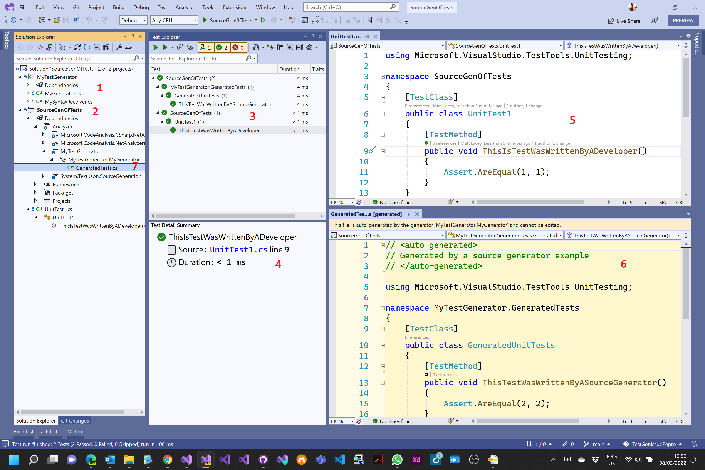
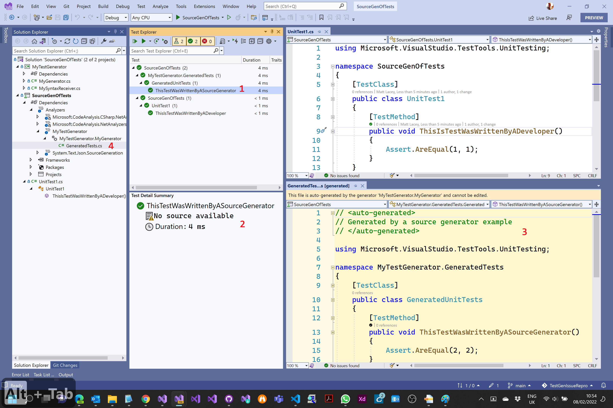

# TestGenIssueRepro

This project exists to explain the issue reported at https://developercommunity.visualstudio.com/t/tests-created-by-a-source-generator-report-no-sour/1631768 and to provide a reproducible example that can be used to verify the issues, and hopefully, eventually confirm a fix.

Below each of the following screenshots are explanations of the numbered elements.

## Scenario 1 - The developer written test selected

1. The Source Generator project. (This always outputs a single file containing a single test.)
2. The MSTest project that contains a single file containing a single test. It also has a reference to the other (source generator) project.
3. Test Explorer showing both the tests (developer written and the generated one). The developer written test is selected.
4. The output from the selected test includes a link to the source of the test.
5. The source of the developer written test.
6. The generated source of the test produced by the SourceGenerator.
7. Where the generated file lives in the Solution Explorer.

## Scenario 2 - The generated test selected

1. The generated test is selected in the Test Explorer.
2. The output from the test (in the Test Detail Summary) claims "No source available".
3. But here is the generated source. Clearly available.
4. The generated source file shown within Solution Explorer.

## The issue and desired solution

When a test fails it is really useful to be able to see the exact code of the failing tests. Currently Visual Studio does not have a way to automatically do this (for tests produced by a Source Generator) and requires that the person investigating the failing test manually hunt for the generated file that contains the failing test. This requires knowing where to look and potentially searching through a large number of large files.  
In that the file is available, I would like to see the appropriate link in the Test Detail Summary output. The current "No source available" message is demonstrably wrong and potentially devalues any 3rd party tools/libraries that want to use source generators to create tests that would improve code quality and increase developer productivity.

_Note.In the above screenshots, the generated files are shown with a golden background. This is due to [an extension I have installed that colors generated files in this way](https://marketplace.visualstudio.com/items?itemName=MattLaceyLtd.ClearlyEditable). It is not relevant to the reported issue._